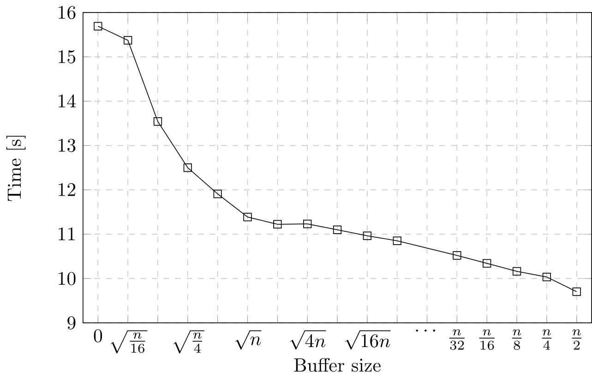
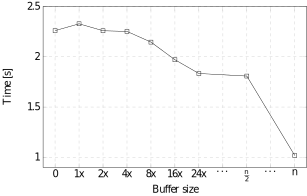
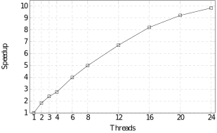
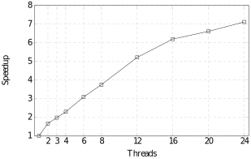

# Parallel Stable Sort
This repository contains a **parallel stable sort** using **arbitrary extra memory** written in C++. It combines classic mergesort, insertion sort and an **in-place merging** method described in [[1]](#1). It is able to utilize varying sizes of element buffers ranging from no buffer at all to the classic buffer with same length as input (or half the input length in sequential version). Though it degrades to using no buffer if specified length would not bring a speedup (generally at least a fraction of $\sqrt{n}$ is needed, where $n$ is the length of the input). The code is parallelized using OpenMP.

## Performance
What follows is a brief showcase of what performance to expect. Tests were done on a machine with 2x Xeon E5-2620 v2 (12 cores, 24 threads) using a randomly sorted array of $10^8$ integers.

Single thread performance compared with std::stable_sort from STL:
<table>
  <tr>
    <th>Algorithm:</th>
    <td>Out-place mergesort</td>
    <td>std::stable_sort</td>
    <td>In-place mergesort</td>
  </tr>
  <tr>
    <th>Time:</th>
    <td>9.698 s</td>
    <td>10.750 s</td>
    <td>15.692 s</td>
  </tr>
</table>

Sequential time based on buffer size:



Parallel time using 24 threads based on buffer size (x stands for minimum buffer size to be used by 1 thread):



Out-place mergesort parallel speedup:



In-place mergesort parallel speedup:



## Usage Example
```c++
#include "hybridsort.h"
…
std::vector<int> vec;
…
HybridSort(vec.begin(), vec.end()); // by default sorts with extra buffer of elements with length equal to end - begin
HybridSort(vec.begin(), vec.end(), compare_func); // sorts while using compare_func to compare elements
HybridSort(vec.begin(), vec.end(), std::less<>(), 0); // sorts with no extra memory buffer
HybridSort(vec.begin(), vec.end(), std::less<>(), -1LL); // sorts with maximum extra memory buffer
HybridSort(vec.begin(), vec.end(), std::less<>(), 1000, 4); // sorts with a buffer of 1000 elements using 4 threads
```

## References
<a id="1">[1]</a> 
Kim, PS., Kutzner, A. (2008). Ratio Based Stable In-Place Merging. In: Agrawal, M., Du, D., Duan, Z., Li, A. (eds) Theory and Applications of Models of Computation. TAMC 2008. Lecture Notes in Computer Science, vol 4978. Springer, Berlin, Heidelberg. https://doi.org/10.1007/978-3-540-79228-4_22
